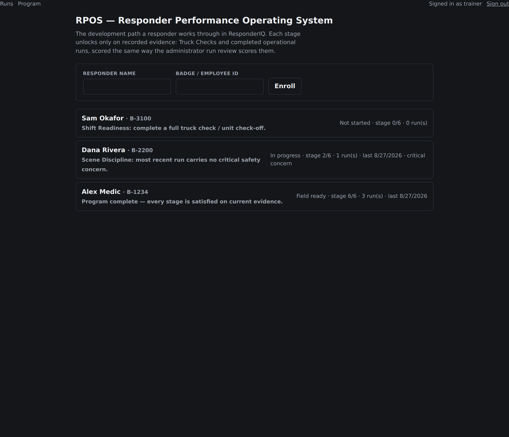
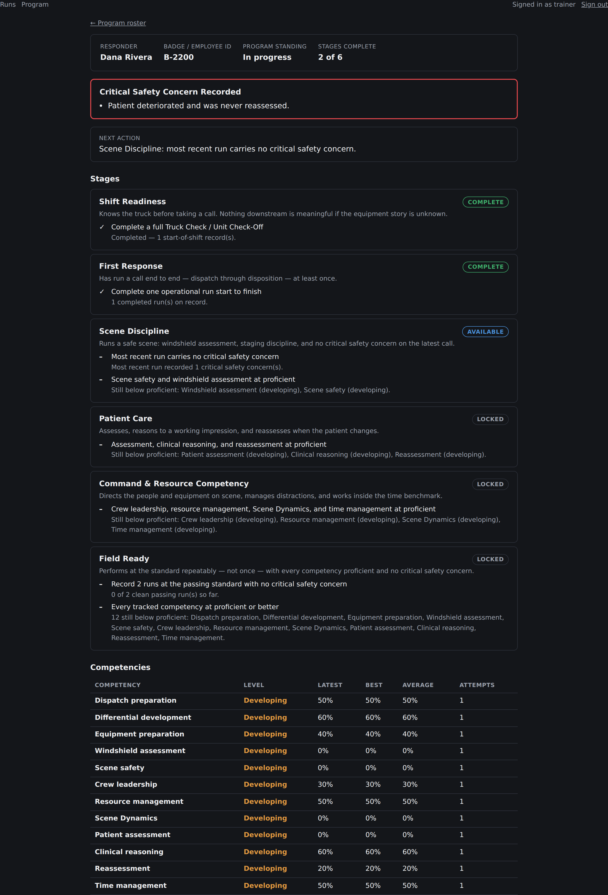

# RPOS — Responder Performance Operating System

## What it is

A single completed run answers *how did that call go?* RPOS answers the
question an agency training officer actually has: **where is this responder in
their development, and what is the next thing they need?**

It is a program layer over the runs that already exist — an ordered set of
stages, each gated by requirements that only recorded evidence can satisfy,
plus a competency rollup across every attempt a responder has made.

## Where it lives

| Path | What it holds |
| --- | --- |
| `lib/rpos/types.ts` | The model: competency levels, evidence, stages, program state |
| `lib/rpos/competency.ts` | Runs → a level per behavioral category |
| `lib/rpos/program.ts` | The program definition: six stages and their requirements |
| `lib/rpos/progression.ts` | Evidence + program → stage statuses and the next action |
| `lib/rpos/evidence.ts` | Stored records → the facts the program reasons about |
| `lib/rpos/load.ts` | The database read path (the only server-only file here) |
| `lib/rpos/actions.ts` | Enrollment Server Action |
| `lib/db/programEnrollments.ts` | The roster table |
| `components/Program/` | Roster, one responder's standing, enrollment form |
| `app/admin/program/` | `/admin/program` and `/admin/program/[badgeId]` |

Everything except `load.ts` and `actions.ts` is pure and tested without a
database.

## The stages

Stages are worked in order. A stage whose requirements are already satisfied
still reads **locked** while an earlier stage is open — otherwise the ordering
the program exists to enforce would be decoration. What is met inside a locked
stage stays visible; it just does not count yet.

| # | Stage | Gate |
| --- | --- | --- |
| 1 | Shift Readiness | A completed Truck Check / Unit Check-Off on record |
| 2 | First Response | One operational run completed start to finish |
| 3 | Scene Discipline | No critical safety concern on the most recent run; scene safety and windshield assessment proficient |
| 4 | Patient Care | Patient assessment, clinical reasoning, and reassessment proficient |
| 5 | Command & Resource Competency | Crew leadership, resource management, Scene Dynamics, and time management proficient |
| 6 | Field Ready | Two runs at the passing standard with no critical safety concern, and every tracked competency proficient |

## Competency levels

Each of the twelve behavioral categories the run review scores rolls up to a
level:

| Level | Meaning |
| --- | --- |
| Not started | No recorded run has exercised it |
| Developing | Below the passing standard on the most recent run |
| Proficient | At or above the passing standard (75) on the most recent run |
| Mastered | At or above the top grading band (90) on the most recent run, and has been before |

Thresholds are read from `DEFAULT_SIMULATOR_CONFIG.scoring` rather than
introduced here, so a spec change to the standard moves the program with it
instead of leaving two standards in the codebase.

The level is deliberately **recency-weighted**: a responder who scored 100
once and 40 on their last two runs is developing, not mastered. Best and
average are reported alongside, so a training officer can tell "never could"
apart from "could, and has stopped".

## Rules it inherits

- **Nothing derived is stored.** Stage status, competency levels, and program
  standing are computed at read time from `truck_check_attempts` and
  `operational_runs`, exactly as administrator run scores are. Only the roster
  (who is on the program) is persisted.
- **A high score never erases a critical safety concern.** Concerns from the
  most recent run are surfaced on their own and gate stage 3 and stage 6,
  independent of any number.
- **Administrator-only.** Like every other view that exposes scored
  performance, the program lives behind the admin session. There is no
  learner-facing program page; adding one would put derived scores in front of
  learners.

## Identity

A responder is one badge ID. `operational_runs.badge_id` and
`truck_check_attempts.learner_id` are the same identifier from two different
slices; that equivalence is asserted once, in `lib/rpos/load.ts`. A responder
with runs but no roster entry is still readable at
`/admin/program/<badge>` — the name then comes from the run they signed.

## Screenshots





Regenerate with a running server and a seeded admin account:

```bash
BASE_URL=http://localhost:3900 ADMIN_USERNAME=... ADMIN_PASSWORD=... \
  PROGRAM_BADGE=B-1234 node scripts/screenshots-program.mjs
```
