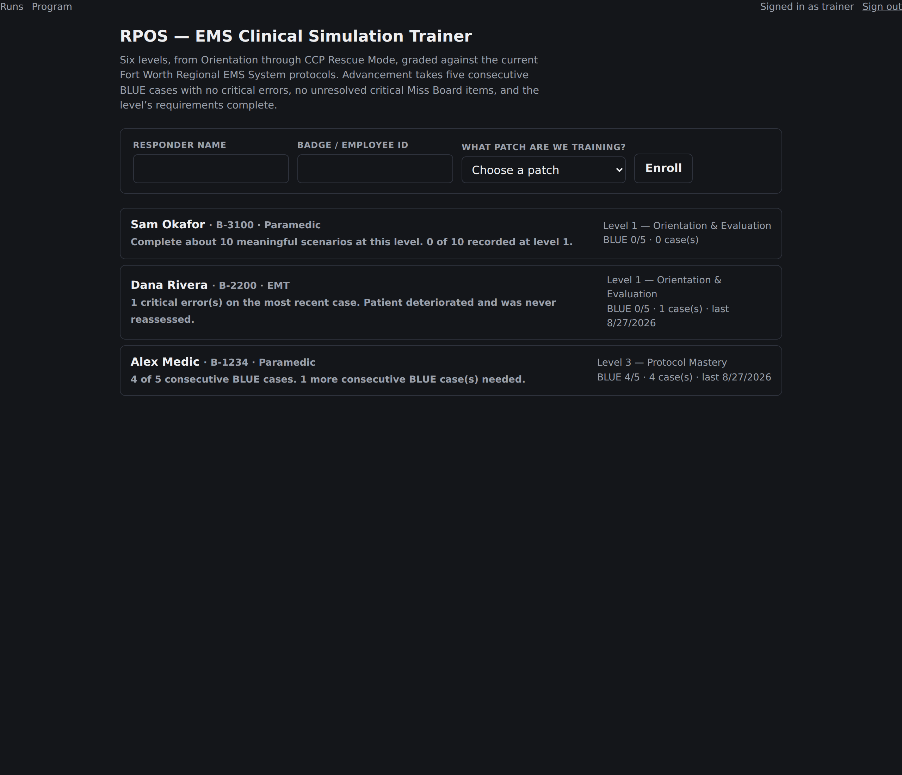
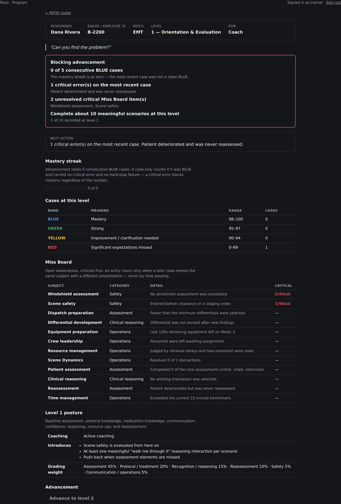

# RPOS in this repository

[SPEC.md](SPEC.md) is the program as the master prompts define it. This file is
how it is built.

## Where it lives

| Path | What it holds |
| --- | --- |
| `lib/rpos/types.ts` | The model: certification, levels, bands, cases, Miss Board, hard stops |
| `lib/rpos/levels.ts` | The six levels — titles, call signs, coaching posture, stated numbers |
| `lib/rpos/grading.ts` | BLUE/GREEN/YELLOW/RED and the Level 1 weighting |
| `lib/rpos/hardStops.ts` | MAX BVM and DSI checklists, and the no-partial-credit rule |
| `lib/rpos/missBoard.ts` | The six categories, the retest queue, and resolution |
| `lib/rpos/progression.ts` | The advancement rule |
| `lib/rpos/evidence.ts` | The bridge from recorded BLS-01 runs to RPOS cases |
| `lib/rpos/load.ts` | The database read path (the only server-only file here) |
| `lib/rpos/actions.ts` | Enrollment and advancement Server Actions |
| `lib/db/rposEnrollments.ts` | The roster |
| `lib/db/rposMissBoard.ts` | Miss Board persistence |
| `components/Rpos/` | Roster, one responder's standing, enrollment and advancement forms |
| `app/admin/rpos/` | `/admin/rpos` and `/admin/rpos/[badgeId]` |

Everything except `load.ts` and `actions.ts` is pure and tested without a
database.

## What is stored, and what is not

Stored: **the roster** (who is on the program, their patch, their level) and
**the Miss Board**.

The Miss Board is stored deliberately, and it is the one derived-looking thing
that is: an entry's whole point is that it outlives the case that created it
and stays open until a later case retests it. Which case cleared it, and when,
is a fact about history — not something recomputable from current state. Miss
Board entries are stamped with the **case's** timestamp, not the row's insert
time, or a case could never clear an entry synced after it ran.

Not stored: standing, bands, the mastery streak, eligibility. All derived at
read time, the same discipline administrator run scores follow — nothing
derived can go stale or leak.

## Administrator-only

Like every other view that exposes grading. There is no learner-facing standing
page; adding one would put band history and the Miss Board in front of
learners.

## Screenshots





Regenerate with a running server and a seeded admin account:

```bash
BASE_URL=http://localhost:3900 ADMIN_USERNAME=... ADMIN_PASSWORD=... \
  RPOS_BADGE=B-1234 node scripts/screenshots-rpos.mjs
```
